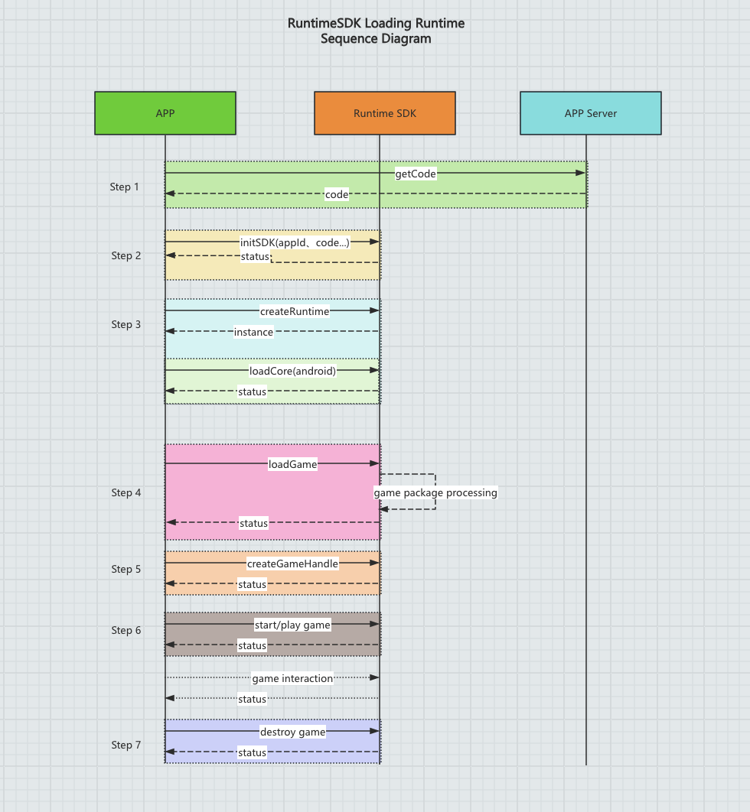

# Integrating SudGIP SDK in an iOS Project

> **Description:**
> The **SudGIP SDK** contains the Game Runtime module.
> By following the steps below, you can easily integrate the SDK into your project and use the Game Runtime to load and run games.

---

## 1. Add SDK Dependency via CocoaPods

Example setup using **Xcode 16.4** and the target project **QuickStart-Runtime**.

### Step 1: Add SDK to Your Project

In your project’s `Podfile`, include the following:

```ruby
pod 'SudGIP', :path => '../../'
```

Then open a macOS terminal, navigate to the directory containing the Podfile, and run:

```bash
pod install
```

After installation, an `QuickStart-Runtime.xcworkspace` file will be generated.
Open this workspace file in Xcode.

---

## 2. Manual Integration (Alternative)

### Step 1: Add SDK Framework Manually

Using **Xcode 16.4**, with the target **QuickStart-Runtime**:

1. Copy the `SudGIP.xcframework` into your project directory.
2. In **Xcode**, select the project target (`QuickStart-Runtime`) → open **Build Phases**.
3. Under **Link Binary With Libraries**, drag `SudGIP.xcframework` into the list.
4. Go to **General → Frameworks, Libraries, and Embedded Content**,
   and set **SudGIP.xcframework** to **Embed & Sign**.

---

### Step 2: Environment Configuration

- In **TARGETS → Build Settings → Other Linker Flags**,
  add the flag: `-ObjC` (both O and C must be uppercase, include the dash `-`).
- In **TARGETS → Build Settings → Enable Bitcode**,
  set the value to **NO**.

---

### Step 3: Import SDK Header File

```objc
#import <SudGIP/SudGIP-umbrella.h>
```

---

## 3. Game Runtime Module APIs

```objc
/// Game SudRuntime2
@interface SudRuntime2 : NSObject

/// Initialize the SDK
/// - Parameter paramModel: Required parameters
/// - Parameter completion: completion description
+(void)initSDK:(SudRtInitSDKParamModel *)paramModel
    completion:(nullable void(^)(NSError *_Nullable error))completion;

/// Reset the initialized SDK, called when SDK re-initialization is needed
+(void)uninitSDK;

/// Create a runtime instance (single process has only one)
/// @param options Optional configuration parameters for the runtime
/// @param completion Completion callback
+(void)createRuntime:(NSDictionary *_Nullable)options
          completion:(nullable void(^)(id<SudRt2GameRuntime> _Nullable runtime, NSError *_Nullable error))completion;

/// Load game package
/// @param paramModel Load parameters
/// @param progress Progress callback
/// @param completion Completion callback
+(void)loadPackage:(SudRt2LoadPackageParamModel *)paramModel
       progress:(nullable void(^)(NSInteger progress))progress
     completion:(nullable void(^)(NSError *_Nullable error))completion;

@end
```

---

## 4. Key Steps for Using the Game Runtime

Example usage is available in the `QuickStart-Runtime` sample project included in the SDK package.

### Step 1: Initialize the SDK

Before using the runtime, initialize the SDK and obtain the runtime authorization.

```objc
/// Initialize the SDK
/// - Parameter paramModel: Required parameters
/// - Parameter completion: completion description
+(void)initSDK:(SudRtInitSDKParamModel *)paramModel
    completion:(nullable void(^)(NSError *_Nullable error))completion;
```

---

### Step 2: Create the Runtime Environment

Create a single runtime instance per process:

```objc
/// Create a runtime instance (single process has only one)
/// @param options Optional configuration parameters for the runtime
/// @param completion Completion callback
+(void)createRuntime:(NSDictionary *_Nullable)options
          completion:(nullable void(^)(id<SudRt2GameRuntime> _Nullable runtime, NSError *_Nullable error))completion;
```

---

### Step 3: Manage Game Packages

Load a game package using the following method.
The runtime will automatically download and install the game package and its required plugins.
Once downloaded, the package will be cached for faster future loads.

```objc
/// Load game package
/// @param paramModel Load parameters
/// @param progress Progress callback
/// @param completion Completion callback
+(void)loadPackage:(SudRt2LoadPackageParamModel *)paramModel
       progress:(nullable void(^)(NSInteger progress))progress
     completion:(nullable void(^)(NSError *_Nullable error))completion;
```

---

### Step 4: Runtime Management

After successfully loading a game package, you can create and manage a game instance
through the `SudRt2GameRuntime` interface.

Refer to:

- [SudRt2GameRuntime API Documentation](SudRt2GameRuntime_en.md) — for runtime creation and management
- [SudRt2GameHandle API Documentation](SudRt2GameHandle_en.md) — for game lifecycle control

---

## 5. Demo Example

For a full working example, see the **QuickStart-Runtime** project’s
`ViewController` implementation in the `Example` directory.

---

## 6. SDK Workflow Diagram


