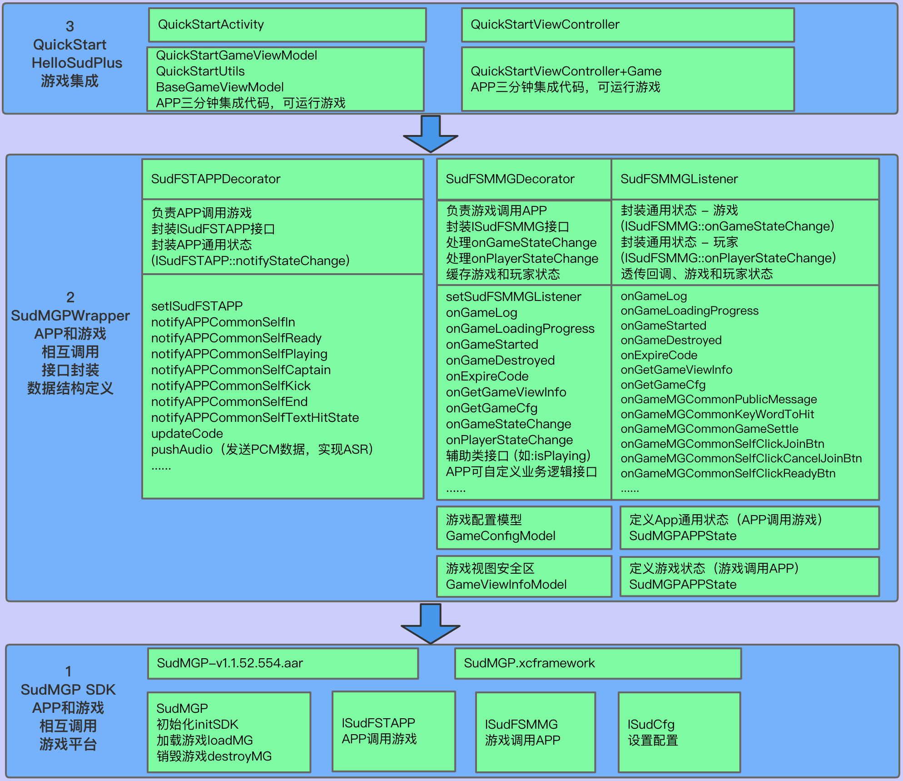

# Start your journey with SUD games through quick integration and debugging
- Step 1: Integrate SUD games into your app client (3-minute code integration)
  <details> 
  <summary>Details</summary> 

      1. Use the QuickStart client's appId, appKey, and set isTestEnv=true; 
      2. Use your own iOS bundleId and Android applicationId (found in the integration information table); 
      3. Use the short-term token code provided by QuickStart's backend service (obtained through login/getCode); 
      4. Once integrated, the game should run smoothly. 

      ***SUD platform supports multiple bundleIds and applicationIds bound to a single appId;*** 
      ***After filling out the integration information table, SUD will bind your app's bundleId and applicationId to QuickStart's appId, only in the test environment.*** 
  QuickStart backend service [hello-sud-java code repository](https://github.com/SudTechnology/hello-sud-java). If you cannot access the repository, please contact SUD to add your GitHub account.
  </details> 


- Step 2: Debug the app client and server
  <details> 
  <summary>Details</summary> 

      1. Implement 4 HTTP APIs on the app server (as listed in the integration information table); 
      2. Implement the login/getCode interface on the app server to obtain the short-term token code; 
      3. Use your own appId, appKey, isTestEnv=true, bundleId (iOS), and applicationId (Android); 
      4. Use your own app server's login/getCode interface to obtain the short-term token code; 
      5. Debug 5 HTTP APIs between the app client and server; 
      6. Once HTTP API debugging is complete, move on to the next step. 
  </details> 


- Step 3: Focus on your own app's business needs
  <details> 
  <summary>Details</summary> 

      1. Refer to the SudMGP documentation, SudMGPWrapper, QuickStart, and the HelloSud demo (which showcases multiple scenarios, including custom scenarios); 
      2. Focus on your app's UI interaction, functionality, and implementation; 
      For example: 
      Adjusting the size and position of the game view; 
      Adjusting the interaction flow between the app and game, whether UI elements can be hidden, whether buttons can be hidden in the app implementation, and whether click events can be intercepted for callbacks; 
       
      3. Focus on your app's business logic and implementation; 
      For example: 
      How to pass numerical type parameters and key type parameters during a game (settlement); 
  
  
  </details>

# 3-Minute Code Integration

- Step 1: Import SudMGPSDK and SudMGPWrapper modules
  <summary>CocoaPods import method</summary> 

      1. Add SudMGPWrapper dependency to the app's main Podfile;[Cocoapods new version](https://github.com/SudTechnology/sud-mgp-ios/blob/main/README_en.md)

  ```ruby
  pod 'SudMGPWrapper', '~> x.x.x'
  ```
      2. Run pod install to add SudMGP SDK and SudMGPWrapper module dependencies to the project.

  </details> 
  <details> 
  <details> 
  <summary>Local pod import method</summary> 

      1. Copy all files in the SudMGPSDK and SudMGPWrapper directories, as well as the SudMGPWrapper.podspec file, to the target project's Podfile directory. 

      2. Add SudMGPWrapper dependency to the app's main Podfile;
  ```ruby
  pod 'SudMGPWrapper', :path => '../../'
  ```
      3. Run pod install to add SudMGP SDK and SudMGPWrapper module dependencies to the project.
  </details> 
  <details> 

  <summary>ASR recognition support (optional, supported in v1.2.7 and later)</summary> 

      1. Add ASR speech recognition library dependency to the app's main Podfile;

  ```ruby 
  pod 'MicrosoftCognitiveServicesSpeech-iOS', '1.23.0'
  ```
      3. Run pod install to add the ASR speech recognition library module dependencies to the project.
  </details> 


- Step 2：Reuse the QuickStart management module for game operations, located in the project SudGameHelper folder
  <details>
  <summary>detail</summary>

  Copy SudGameHelper directory, Demo project directory path (project->SudGameHelper): 
  `SudGameManager` loads the game and destroys the game management module. 
  `BaseSudGameEventHandler` processes the interaction between the game and the APP. The app only needs to create subclasses and receive defined game callbacks to receive various game state callbacks
  </details>
  

- Step 3：Define a game in the target ViewController View containers, such as: QuickStartViewController.h
    <details>
    <summary>detail QuickStartViewController.h</summary>

    ``` objc
    @interface QuickStartViewController ()
    /// 游戏加载主view
    @property(nonatomic, strong) UIView *gameView;
    ```
    </details>
  
- Step 4：Create a game interaction event handler subclass that inherits from `BaseSudGameEventHandler` and implements the necessary interfaces, for example：QuickStartSudGameEventHandler.h
    <details>
    <summary>detail `QuickStartSudGameEventHandler` </summary>

    #### Class declaration QuickStartSudGameEventHandler.h
    ``` objc
    /// QuickStart demo实现游戏事件处理模块，接入方可以参照次处理模块，将QuickStartSudGameEventHandler改个名称并实现自己应用的即可
    /// QuickStart demo game event processing module, access can consult the processing module, the QuickStartSudGameEventHandler change a name and realize their own application
    @interface QuickStartSudGameEventHandler : BaseSudGameEventHandler
    @end
    ```
    #### Implement necessary interfaces, detail QuickStartSudGameEventHandler.m

        1. Return to the game configuration, mainly configure the game mode, button customization and other UI, such as the following sample configuration:

    ``` objc
    - (nonnull GameCfgModel *)onGetGameCfg {
        GameCfgModel *gameCfgModel = [GameCfgModel defaultCfgModel];
        /// 可以在此根据自身应用需要配置游戏，例如配置声音
        /// You can configure the game according to your application needs here, such as configuring the sound
        gameCfgModel.gameSoundVolume = 100;
        /// ...
        return gameCfgModel;
    }
    ```
    2. Return the size of the overall area of the game view and the safety zone (reserved space between the top and bottom), as shown in the following example:

    ``` objc
    - (nonnull GameViewInfoModel *)onGetGameViewInfo {
        
        /// 应用根据自身布局需求在此配置游戏显示视图信息
        /// The application configures the game display view information here according to its layout requirements
        
        // 屏幕安全区
        // Screen Safety zone
        UIEdgeInsets safeArea = [self safeAreaInsets];
        // 状态栏高度
        // Status bar height
        CGFloat statusBarHeight = safeArea.top == 0 ? 20 : safeArea.top;
        
        GameViewInfoModel *m = [[GameViewInfoModel alloc] init];
        CGRect gameViewRect = self.loadConfigModel.gameView.bounds;

        // 游戏展示区域
        // Game display area
        m.view_size.width = gameViewRect.size.width;
        m.view_size.height = gameViewRect.size.height;
        // 游戏内容布局安全区域，根据自身业务调整顶部间距
        // Game content layout security area, adjust the top spacing according to their own business
        // 顶部间距
        // top spacing
        m.view_game_rect.top = (statusBarHeight + 80);
        // 左边
        // Left
        m.view_game_rect.left = 0;
        // 右边
        // Right
        m.view_game_rect.right = 0;
        // 底部安全区域
        // Bottom safe area
        m.view_game_rect.bottom = (safeArea.bottom + 100);
        return m;
    }
    ```

    3. Return the code when the game is loaded, <font color=Red> The interface access side must inherit the implementation, through its own application interface to obtain the code required when the game is loaded </font>

    ``` objc
    - (void)onGetCode:(NSString *)userId result:(void (^)(NSString * _Nonnull))result {
    
        /// 获取加载游戏的code,此处请求自己服务端接口获取code并回调返回即可
        /// Get the code of loading the game, here request your server interface to get the code and callback return
        
        if (userId.length == 0) {
            NSLog(@"用户ID不能为空");
            return;
        }
        
        /// 以下是当前demo向demo应用服务获取code的代码
        /// The following is the code that demo obtains the code from demo application service
        
        /// 此接口为QuickStart样例请求接口
        /// This interface is a QuickStart sample request interface
        NSString *getCodeUrl = @"https://mgp-hello.sudden.ltd/login/v3";
        NSDictionary *dicParam = @{@"user_id": userId};
        [self postHttpRequestWithURL:getCodeUrl param:dicParam success:^(NSDictionary *rootDict) {

            NSDictionary *dic = [rootDict objectForKey:@"data"];
            /// 这里的code用于登录游戏sdk服务器
            /// The code here is used to log in to the game sdk server
            NSString *code = [dic objectForKey:@"code"];
            int retCode = (int) [[dic objectForKey:@"ret_code"] longValue];
            result(code);

        }                    failure:^(NSError *error) {
            NSLog(@"login game server error:%@", error.debugDescription);
        }];
    
    }
    ```
    </details>

- Step 5：Create `SudGameManager` game management module instance, instance `QuickStartSudGameEventHandler` event processing module, for example：QuickStartViewController.m
    <details>
    <summary>detail QuickStartViewController.m</summary>

    ```objc
    - (void)viewDidLoad {
        [super viewDidLoad];
        // Do any additional setup after loading the view.
        self.view.backgroundColor = UIColor.blackColor;
        
        /// 1. step
        
        // 创建游戏管理实例
        // Create a game management instance
        self.sudGameManager = SudGameManager.new;;
        // 创建游戏事件处理对象实例
        // Create an instance of the game event handler object
        self.gameEventHandler = QuickStartSudGameEventHandler.new;
        // 将游戏事件处理对象实例注册进游戏管理对象实例中
        // Register the game event processing object instance into the game management object instance
        [self.sudGameManager registerGameEventHandler:self.gameEventHandler];
    

    }
    ```
    </details>
  

- Step 6：Load game
    <details>
    <summary>详细描述 QuickStartViewController.m</summary>


    ``` objc
    /// 加载游戏
    /// Load game
    - (void)loadGame:(int64_t)gameId {
        // 配置加载SudMGP必须参数
        // Set the required parameters for loading SudMGP
        SudGameLoadConfigModel *sudGameConfigModel = [[SudGameLoadConfigModel alloc] init];
        // 申请的应用ID
        // Application ID
        sudGameConfigModel.appId = SUDMGP_APP_ID;
        // 申请的应用key
        // Application key
        sudGameConfigModel.appKey = SUDMGP_APP_KEY;
        // 是否测试环境，测试时为YES, 发布上线设置为NO
        // Set to YES during the test and NO when publishing online
        sudGameConfigModel.isTestEnv = SUD_GAME_TEST_ENV;
        // 待加载游戏ID
        // ID of the game to be loaded
        sudGameConfigModel.gameId = gameId;
        // 指定游戏房间，相同房间号的人在同一游戏大厅中
        // Assign a game room, and people with the same room number are in the same game hall
        sudGameConfigModel.roomId = self.roomId;
        // 配置游戏内显示语言
        // Configure the in-game display language
        sudGameConfigModel.language = @"zh-CN";
        // 游戏显示的视图
        // Game display view
        sudGameConfigModel.gameView = self.gameView;
        // 当前用户ID
        // Current user id
        sudGameConfigModel.userId = QSAppPreferences.shared.currentUserID;

        [self.sudGameManager loadGame:sudGameConfigModel];
    }       
    ```
    </details>
  

- Step 7：Destroy game
    <details>
    <summary>detail QuickStartViewController.m</summary>

    ``` objc
    /// 销毁游戏
    /// Destroy game
    - (void)destroyGame {
        [self.sudGameManager destroyGame];
    }
    ```
    </details>  

# QuickStart Architecture Diagram


# 1. SudMGP SDK
### 1.1 SudMGP Client SDK

- [Download SudMGP-Android-v1.1.52.554.zip](https://github.com/SudTechnology/sud-mgp-android/releases)
- [Download SudMGP-iOS-v1.1.52.527.zip](https://github.com/SudTechnology/sud-mgp-ios/releases)

### 1.2 Integration Documentation

- [Integration Documentation](https://docs.sud.tech/en/app/Client/API/)
- [FAQ](https://docs.sud.tech/en/app/Client/FAQ/)

# 2. SudMGPWrapper
-  SudMGPWrapper encapsulates SudMGP and simplifies the interface for app and game interaction ;
-  SudMGPWrapper is maintained and updated regularly ;
-  It is recommended for app integration to use SudMGPWrapper ;
-  SudMGPAPPState ,  SudMGPMGState ,  SudFSMMGListener ,  SudFSMMGDecorator ,  SudFSTAPPDecorator are core classes .

### 2.1 App State and Game State
-  SudMGPAPPState  encapsulates [App Common State](https://docs.sud.tech/en/app/Client/APPFST/CommonState.html);
-  SudFSTAPPDecorator  encapsulates two types of [ISudFSTAPP](https://docs.sud.tech/en/app/Client/API/ISudFSTAPP.html) interfaces, [notifyStateChange](https://docs.sud.tech/en/app/Client/APPFST/CommonState.html) and foo;
-  SudFSTAPPDecorator  is responsible for encapsulating each App common state into an interface;
    <details> 
    <summary>Code framework objc class SudFSTAPPDecorator</summary>

    ```objc
    /// app -> game
    @interface SudFSTAPPDecorator : NSObject
    
        @property (nonatomic, strong) id<ISudFSTAPP> iSudFSTAPP;
    
        /// setI SudFSTAPP = [SudMGP loadMG:userId roomId:roomId code:code mgId:mgId language:language fsmMG:self.sudFSMMGDecorator rootView:rootView];
        - (void)setISudFSTAPP:(id<ISudFSTAPP>)iSudFSTAPP;
        ...
    
        /// Continue the game
        - (void)playMG;
        /// Pause the game
        - (void)pauseMG;
        /// Destroy the game
        - (void)destroyMG;
        /// Get the game view
        - (UIView *) getGameView;
        /// Update code
        /// @param code New code
        - (void)updateCode:(NSString *) code;
        /// Transfer audio data: The input audio data must be: PCM format, sample rate: 16000, sample depth: 16, channel number: MONO
        - (void)pushAudio:(NSData *)data;
        @end
     ```
    </details> 

### 2.2 Game Calls App
-  SudMGPMGState  encapsulates [Common State - Game](https://docs.sud.tech/en/app/Client/MGFSM/CommonStateGame.html) and [Common State - Player](https://docs.sud.tech/en/app/Client/MGFSM/CommonStatePlayer.html);
-  SudFSMMGListener  encapsulates three types of [ISudFSMMG](https://docs.sud.tech/en/app/Client/API/ISudFSMMG.html) callback functions, onGameStateChange, onPlayerStateChange, and onFoo;
-  SudFSMMGListener  is responsible for encapsulating each game state into a separate callback function;
    <details> 
    <summary>Code framework objc interface SudFSMMGListener</summary>

    ```objc
    @protocol SudFSMMGListener <NSObject>
    
        @required
        /// Get game view information  【Need to implement】
        - (void)onGetGameViewInfo:(nonnull id<ISudFSMStateHandle>)handle dataJson:(nonnull NSString *)dataJson;
    
        /// Short-term token code expires  【Need to implement】
        - (void)onExpireCode:(nonnull id<ISudFSMStateHandle>)handle dataJson:(nonnull NSString *)dataJson;
    
        /// Get game config  【Need to implement】
        - (void)onGetGameCfg:(nonnull id<ISudFSMStateHandle>)handle dataJson:(nonnull NSString *)dataJson;
    
    
        @optional
        /// Game starts
        - (void)onGameStarted;
    
        /// Game destroyed
        - (void)onGameDestroyed;
    
        /// Common state - game
        /// Game: Public screen message state    MG_COMMON_PUBLIC_MESSAGE
        - (void)onGameMGCommonPublicMessage:(nonnull id<ISudFSMStateHandle>)handle model:(MGCommonPublicMessageModel *)model;
    
        ...
        @end
    ```
    </details> 

  - [ISudFSMMG](https://docs.sud.tech/en/app/Client/API/ISudFSMMG.html) decorator class  SudFSMMGDecorator , responsible for dispatching each game state, caching required game states
      <details> 
      <summary>class SudFSMMGDecorator</summary>

    ```objc
    /// game -> app
    @interface SudFSMMGDecorator : NSObject <ISudFSMMG>
  
        typedef NS_ENUM(NSInteger, GameStateType) {
            /// Idle
            GameStateTypeLeisure = 0,
            /// loading
            GameStateTypeLoading = 1,
            /// playing
            GameStateTypePlaying = 2,
        };
  
        /// Current user ID
        @property(nonatomic, strong, readonly)NSString *currentUserId;
        // Game state enumeration: GameStateType
        @property (nonatomic, assign) GameStateType gameStateType;
        /// Whether the current user has joined
        @property (nonatomic, assign) BOOL isInGame;
        /// Whether it is in the game
        @property (nonatomic, assign) BOOL isPlaying;
      
        ...
  
        /// Set event handler
        /// @param listener Event handling instance
        - (void)setEventListener:(id<SudFSMMGListener>)listener;
        /// Set the current user ID
        /// @param userId Current user ID
        - (void)setCurrentUserId:(NSString *)userId;
        /// Clear all stored arrays
        - (void)clearAllStates;
        /// 2MG success callback
        - (NSString *)handleMGSuccess;
        /// 2MG failure callback
        - (NSString *)handleMGFailure;
  
        #pragma mark - Get the latest state in gamePlayerStateMap
        /// Get user join status
        - (BOOL)isPlayerIn:(NSString *)userId;
        /// Whether the user is in preparation
        - (BOOL)isPlayerIsReady:(NSString *)userId;
        /// Whether the user is in the game
        - (BOOL)isPlayerIsPlaying:(NSString *)userId;
        /// Whether the user is the captain
        - (BOOL)isPlayerIsCaptain:(NSString *)userId;
        /// Whether the user is painting
        - (BOOL)isPlayerPaining:(NSString *)userId;
  
        #pragma mark - Check if it exists in gamePlayerStateMap (used to determine if the user is in the game)
        /// Whether the user has joined the game
        - (BOOL)isPlayerInGame:(NSString *)userId;
        @end
    ```
    </details>

# 3. QuickStart
- 3.1 Please use the QuickStart project to run.
- 3.2 QuickStart uses SudMGPWrapper and SudMGPSDK to enable fast integration of games.
- 3.3 Quick integration guides: [StartUp-Android](https://docs.sud.tech/zh-CN/app/Client/StartUp-Android.html) and [StartUp-iOS](https://docs.sud.tech/zh-CN/app/Client/StartUp-iOS.html).
- 3.4  The 'SudGameHelper' directory is a module that uses the game itself to encapsulate reusable game-related interfaces, and can be copied to the access application for reuse
- 3.5  QuickStartViewController  displays the relevant UI for the game room.
- 3.6  QuickStart Server  [hello-sud-java](https://github.com/SudTechnology/hello-sud-java) contains the login (App getCode to obtain a short-term token code) functionality. If it cannot be accessed, please contact SUD to add the GitHub account.

# 4. QuickStart Running Screenshots


- HelloSud Experience Demo (showcasing multiple business scenarios)


# 5. Sequence Diagram of Client App and SudMGP SDK Calls


