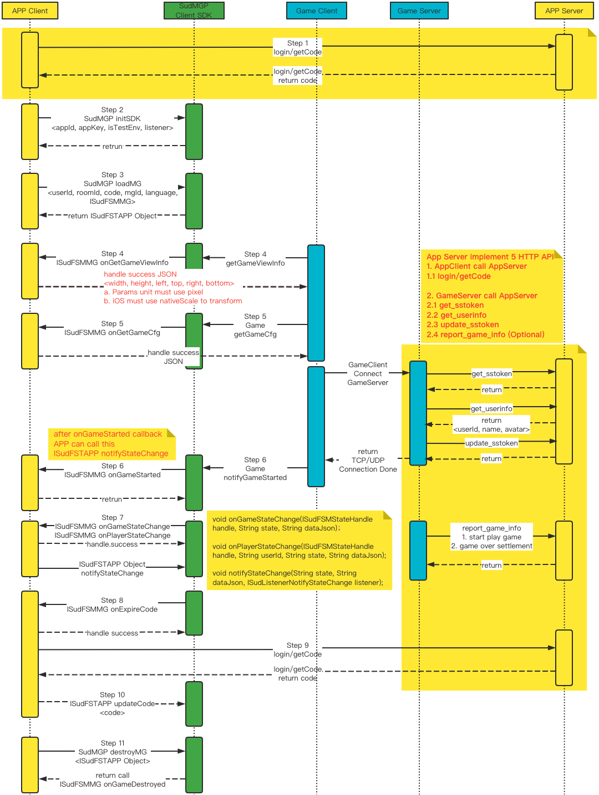

# QuickStart 架构图


# 1. SudMGP SDK
### 1.1 SudMGP Android 客户端SDK
- 例如：SudMGP-v1.1.52.554.aar
- [下载 SudMGP-Android SDK](https://github.com/SudTechnology/sud-mgp-android/releases)
  
### 1.2 SudMGP iOS 客户端SDK
- 例如：SudMGP.xcframework
- [下载 SudMGP-iOS SDK](https://github.com/SudTechnology/sud-mgp-ios/releases)

### 1.3 接入文档
- [接入文档](https://docs.sud.tech/zh-CN/app/Client/)

### 1.4 接入FAQ
 - 准备中，敬请期待

# 2. SudMGPWrapper
- `SudMGPWrapper封装SudMGP，简化App和游戏相互调用接口`；
- `SudMGPWrapper长期维护和保持更新`；
- `推荐APP接入方使用SudMGPWrapper`；
- `SudMGPAPPState`、`SudMGPMGState`、`SudFSMMGListener`、`SudFSMMGDecorator`、`SudFSTAPPDecorator核心类`；

### 2.1 App状态和游戏状态
- `SudMGPAPPState` 封装 [App通用状态](https://docs.sud.tech/zh-CN/app/Client/APPFST/CommonState.html) ；
- `SudFSTAPPDecorator` 封装 [ISudFSTAPP](https://docs.sud.tech/zh-CN/app/Client/API/ISudFSTAPP.html) 两类接口，[notifyStateChange](https://docs.sud.tech/zh-CN/app/Client/APPFST/CommonState.html) 、 foo；
- `SudFSTAPPDecorator` 负责把每一个App通用状态封装成接口；
    <details>
    <summary>代码框架 objc class SudFSTAPPDecorator</summary>

    ``` objc
    /// app -> 游戏
    @interface SudFSTAPPDecorator : NSObject

    @property (nonatomic, strong) id<ISudFSTAPP> iSudFSTAPP;

    /// setI SudFSTAPP = [SudMGP loadMG:userId roomId:roomId code:code mgId:mgId language:language fsmMG:self.sudFSMMGDecorator rootView:rootView];
    - (void)setISudFSTAPP:(id<ISudFSTAPP>)iSudFSTAPP;
    ...

    /// 继续游戏
    - (void)playMG;
    /// 暂停游戏
    - (void)pauseMG;
    /// 销毁游戏
    - (void)destroyMG;
    /// 获取游戏View
    - (UIView *) getGameView;
    /// 更新code
    /// @param code 新的code
    - (void)updateCode:(NSString *) code;
    /// 传输音频数据： 传入的音频数据必须是：PCM格式，采样率：16000， 采样位数：16， 声道数： MONO
    - (void)pushAudio:(NSData *)data;
    @end
    ```
    </details>

### 2.2 游戏调用App
- `SudMGPMGState` 封装 [通用状态-游戏](https://docs.sud.tech/zh-CN/app/Client/MGFSM/CommonStateGame.html) 和 [通用状态-玩家](https://docs.sud.tech/zh-CN/app/Client/MGFSM/CommonStatePlayer.html) ；
- `SudFSMMGListener` 封装[ISudFSMMG](https://docs.sud.tech/zh-CN/app/Client/API/ISudFSMMG.html) 三类回调函数，onGameStateChange、onPlayerStateChange、onFoo；
- `SudFSMMGListener` 负责把游戏每一个状态封装成单独的回调函数；
    <details>
    <summary>代码框架 objc interface SudFSMMGListener</summary>
    
    ``` objc
    @protocol SudFSMMGListener <NSObject>

    @required
    /// 获取游戏View信息  【需要实现】
    - (void)onGetGameViewInfo:(nonnull id<ISudFSMStateHandle>)handle dataJson:(nonnull NSString *)dataJson;

    /// 短期令牌code过期  【需要实现】
    - (void)onExpireCode:(nonnull id<ISudFSMStateHandle>)handle dataJson:(nonnull NSString *)dataJson;

    /// 获取游戏Config  【需要实现】
    - (void)onGetGameCfg:(nonnull id<ISudFSMStateHandle>)handle dataJson:(nonnull NSString *)dataJson;


    @optional
    /// 游戏开始
    - (void)onGameStarted;

    /// 游戏销毁
    - (void)onGameDestroyed;

    /// 通用状态-游戏
    /// 游戏: 公屏消息状态    MG_COMMON_PUBLIC_MESSAGE
    - (void)onGameMGCommonPublicMessage:(nonnull id<ISudFSMStateHandle>)handle model:(MGCommonPublicMessageModel *)model;

    ...
    @end
    ```
    </details>

- [ISudFSMMG](https://docs.sud.tech/zh-CN/app/Client/API/ISudFSMMG.html) 的装饰类`SudFSMMGDecorator`，负责派发每一个游戏状态，缓存需要的游戏状态
    <details>
    <summary>class SudFSMMGDecorator</summary>
    
    ``` objc
    /// game -> app
    @interface SudFSMMGDecorator : NSObject <ISudFSMMG>

    typedef NS_ENUM(NSInteger, GameStateType) {
        /// 空闲
        GameStateTypeLeisure = 0,
        /// loading
        GameStateTypeLoading = 1,
        /// playing
        GameStateTypePlaying = 2,
    };

    /// 当前用户ID
    @property(nonatomic, strong, readonly)NSString *currentUserId;
    // 游戏状态枚举： GameStateType
    @property (nonatomic, assign) GameStateType gameStateType;
    /// 当前用户是否加入
    @property (nonatomic, assign) BOOL isInGame;
    /// 是否在游戏中
    @property (nonatomic, assign) BOOL isPlaying;
    
    ...

    /// 设置事件处理器
    /// @param listener 事件处理实例
    - (void)setEventListener:(id<SudFSMMGListener>)listener;
    /// 设置当前用户ID
    /// @param userId 当前用户ID
    - (void)setCurrentUserId:(NSString *)userId;
    /// 清除所有存储数组
    - (void)clearAllStates;
    /// 2MG成功回调
    - (NSString *)handleMGSuccess;
    /// 2MG失败回调
    - (NSString *)handleMGFailure;

    #pragma mark - 获取gamePlayerStateMap中最新的一个状态
    /// 获取用户加入状态
    - (BOOL)isPlayerIn:(NSString *)userId;
    /// 获取用户是否在准备中
    - (BOOL)isPlayerIsReady:(NSString *)userId;
    /// 获取用户是否在游戏中
    - (BOOL)isPlayerIsPlaying:(NSString *)userId;
    /// 获取用户是否在队长
    - (BOOL)isPlayerIsCaptain:(NSString *)userId;
    /// 获取用户是否在在绘画
    - (BOOL)isPlayerPaining:(NSString *)userId;

    #pragma mark - 获取是否存在gamePlayerStateMap中 （用于判断用户是否在游戏里了）
    /// 获取用户是否已经加入了游戏
    - (BOOL)isPlayerInGame:(NSString *)userId;
    @end
    ```
    </details>


# 3. QuickStart
- 3.1 请使用QuickStart项目运行；
- 3.2 QuickStart使用SudMGPWrapper、SudMGPSDK实现快速接入游戏；
- 3.3 快速接入文档：[StartUp-Android](https://docs.sud.tech/zh-CN/app/Client/StartUp-Android.html) 和 [StartUp-iOS](https://docs.sud.tech/zh-CN/app/Client/StartUp-iOS.html)
- 3.4 `QSGameRoomViewController(Game)`游戏部分相关调用逻辑：负责login(App getCode) --> SudMGP.initSDK --> SudMGP.loadMG
- 3.5 `QSGameRoomViewController`展示游戏房相关UI展示
- 3.6 `QuickStart 服务端`[hello-sud-java](https://github.com/SudTechnology/hello-sud-java) ，login(App getCode 获取短期令牌code) ，`如果访问不了，请联系SUD添加，github账号`

# 4. QuickStart运行效果图


# 5. 接入方客户端和SudMGP SDK调用时序图

